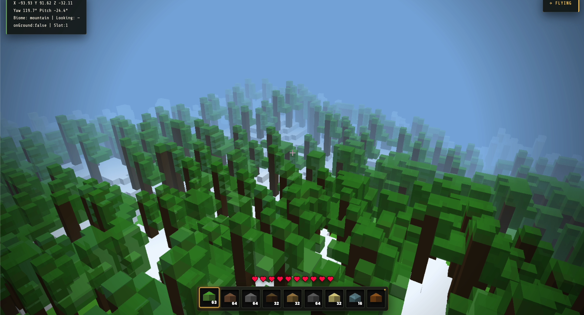
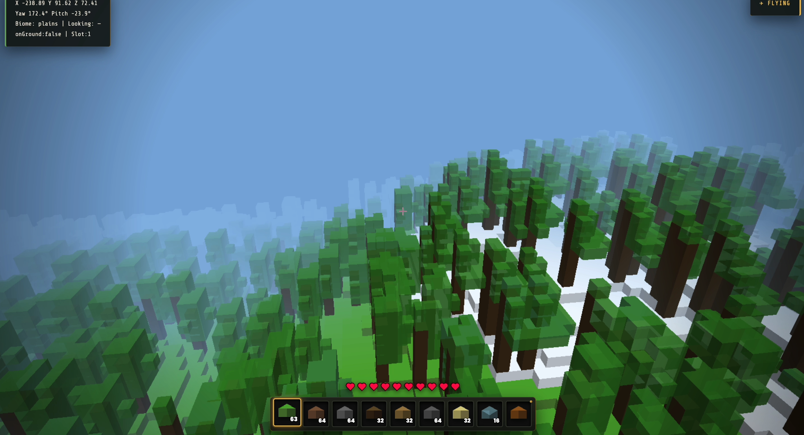

# MinecraftClone

A modular, lightweight 3D sandbox exploration game built from scratch using vanilla HTML5, CSS3, WebGL, and JavaScript ES modules. It features infinite procedural world generation, realistic climate-driven biomes, and a modern glassmorphic user interface.

---
## Demo



----

## Features

- **Procedural World Generation**: Utilizes fractional Brownian motion (FBM) and value noise to generate infinite terrain complete with continental mountain ranges, shorelines, and meandering river channels.
- **Biomes & Climate**: Integrates temperature and moisture simulation models to form distinct biomes (forests, plains, savanna, deserts, taiga, tundra, snowy mountains, beaches, and oceans).
- **Seamless Chunk Boundaries**: Implements a deterministic $7 \times 7$ column decoration pass (Poisson-disc distribution) so that large structures (such as trees and cacti) generate smoothly across chunk borders without visual shearing.
- **Dual-Pass WebGL Renderer**: Splitting rendering into solid (opaque) and alpha (transparent) passes resolves traditional depth-buffer sorting conflicts, allowing semi-transparent water, glass, and leaves to blend cleanly over the terrain.
- **Optimized Performance**: Noise algorithms and linear interpolation helpers are optimized as static, allocation-free functions to prevent garbage collection spikes in performance-critical loops.
- **Skeuomorphic Glassmorphism UI**: Uses high-performance CSS backdrop filters (`backdrop-filter: blur`), inset border shadows, custom SVG health vectors, and clean typography to present an immersive interface.

---

## Directory Structure

```text
mineclone/
├── index.html          # Main HTML structure and UI overlays
├── style.css           # Modern gaming UI stylesheets and screen vignette
└── js/
    ├── constants.js    # Voxel ID maps and world configuration variables
    ├── math.js         # Noise algorithms, matrices, and math utility helpers
    ├── state.js        # Global game state and player records
    ├── world.js        # Terrain generation, climate math, and chunk storage
    ├── player.js       # Raycasting, inventory, mining/placing actions
    ├── physics.js      # Player movement, AABB collisions, and swimming
    ├── renderer.js     # WebGL shaders, buffer management, and drawing cycles
    └── ui.js           # Hotbar rendering, debug panels, and vector HUD elements

```


---

# How to Run Locally

Since MineClone is built using **vanilla JavaScript ES modules**, modern browsers block module loading when opening files directly using the `file://` protocol. Run the project using a local development server instead.

## Option 1: Python HTTP Server

Open a terminal and navigate to the project directory:

```bash
cd path/to/mineclone
```

Start a local server:

```bash
python3 -m http.server 8000
```

For Windows (if `python3` doesn't work):

```bash
python -m http.server 8000
```

Open your browser and visit:

```
http://localhost:8000
```

---

## Option 2: Visual Studio Code (Live Server)

1. Open the project in **Visual Studio Code**.
2. Install the **Live Server** extension by **Ritwick Dey**.
3. Open the **MineClone** project folder.
4. Click **Go Live** in the bottom-right corner of VS Code.

Your browser will automatically open the project.

---

## Option 3: Node.js (`serve`)

Install the `serve` package globally (one-time setup):

```bash
npm install -g serve
```

Navigate to the project directory:

```bash
cd path/to/mineclone
```

Start the server:

```bash
serve .
```

Open the URL displayed in the terminal (typically):

```
http://localhost:3000
```
## License

Free to use, modify, and distribute — for personal projects, no attribution required. 
